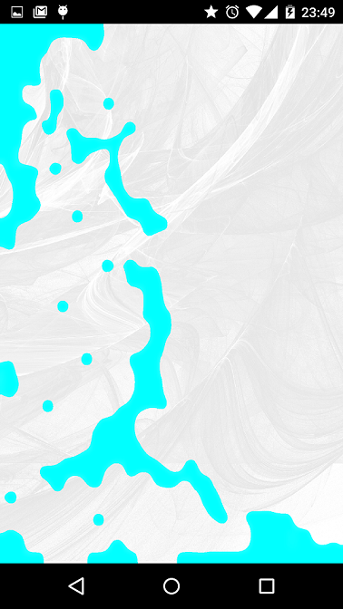

***

# What is LiquidSurface?
LiquidSurface is a simple implementation of the LiquidFun library on a TextureView or GLSurfaceView.
It comes with pre-built C++ libraries, so you don't have to rebuild them.
It is designed to be plug-and-play and can be fit into any view hierarchy you like.
You can:
1. Change the background
2. Create multiple independent liquid systems (unlike liquidfun paint)
3. Create basic solid objects with bitmaps

***

# Running the sample
The library comes with pre-built native binaries so you don't have to run ndkbuild.
If you want to change the native libraries, you should rebuild using SWIG.

***

# Using the Library

### Simple example
The simplest usage of LiquidSurface is:

```xml
    <com.mycardboarddreams.liquidsurface.LiquidSurfaceView
        android:id="@+id/liquid_surface"
        android:layout_height="match_parent"
        android:layout_width="match_parent"/>
```

```java
public class SampleActivity extends ActionBarActivity {

    ILiquidWorld lw;

    @Override
    protected void onCreate(Bundle savedInstanceState) {
        super.onCreate(savedInstanceState);
        setContentView(R.layout.activity_sample);

        lw = (ILiquidWorld) findViewById(R.id.liquid_surface);

        /**
        * Use an array of points to define a shape. The liquid is created inside that.
        */
        Vector2f[] circleVertices = MathHelper.createCircle(new Vector2f(500, 500), 400, 8);
        ParticleGroup liquidShape = new ParticleGroup(circleVertices);
        ltv.createParticles(liquidShape);
    }

    /**
     * Make sure you call the following onResume() and onPause()
     */
    @Override
    protected void onResume() {
        super.onResume();
        lw.resumeParticles();
    }

    @Override
    protected void onPause() {
        super.onPause();
        lw.pauseParticles();
    }
}
```

***

### Background image
If you'd like to change the background image, either replace the following file:
**_liquidview/src/main/assets/textures/home_bg.png_**

with your own image, or add your image to the same folder, then open the file
**_liquidview/src/main/assets/materials/particlerenderer.json_**
and change the following line:

```json
    ...
    "paper": {
        "uDiffuseTexture": "textures/your_filename_here.png"
    }
```

***

### Debug
If you want to debug the liquid physics, open the Renderer class
**_(com.google.fpl.liquidfunpaint.renderer.PhysicsLoop)_**
and set the following line:

```java
public class PhysicsLoop extends Observable<Float> implements DrawableLayer{
    ...
    public static final boolean DEBUG_DRAW = true;
    ...
}
```

***

### TextureView and GLSurfaceView
The library can use a [TextureView](http://developer.android.com/reference/android/view/TextureView.html) or a [GLSurfaceView](http://developer.android.com/reference/android/opengl/GLSurfaceView.html).
Both implement ILiquidWorld. 

The liquid shapes are created from arrays of Vector2f points that define the outline of the shape. The values are relative to the width and height of the TextureView itself. Box2D requires that the shapes always be convex.
Define a ParticleGroup then pass it into createParticles(). The particles are created before the next frame.

```java
public void createParticles(ParticleGroup liquidShape){
    ...
}

// you can also erase those particles.
public void eraseParticles(ParticleEraser eraserShape){
    ...
}
```

***

### Particle Systems
You can create particles in more than one particle system. Particles from separate systems don't interact. Particles from all systems interact with solid objects.

Particle systems are organized by name. The name of default particle system is:
```java
public class ParticleSystems extends HashMap<String, DrawableParticleSystem> {

    public static final String DEFAULT_PARTICLE_SYSTEM = "default_particle_system";
    
}
```
You can decide which system a particle group belongs to by passing in a name when you create a ParticleGroup. Using a name that doesn't exist will create a new system with that name.

***

# Adjustments to Google's LiquidFun library
This library is based on Google's [LiquidFun library](http://google.github.io/liquidfun/), and uses parts of the [LiquidFun Paint](http://google.github.io/LiquidFunPaint/) library.
I've tried to keep most of the code from those two libraries the same, but I was forced to make a few tweaks:

In order to allow for creating arbitrary shapes, I increased the number of vertices you can create per Polygon. This is done in native code:

In the file **src/main/Box2D/Box2D/Common/b2Settings.h**

```cpp
#define b2_maxPolygonVertices	30
```

_b2_maxPolygonVertices_ is the maximum number of vertices per polygon. In the original code it's set to 8.

I also added a method to create a PolygonShape through pairs of floats.

[Recent change]
The shaders can now read the velocity of each particle too.