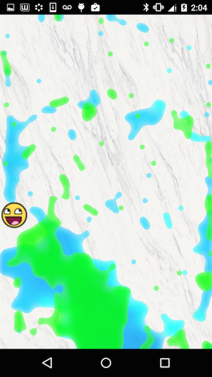

### **--currently the library only works in landscape mode, I'm working to fix that--**



# Running the sample
To run this project you need to do the following:

1. In terminal, go to the following folder:
**<project root>/liquidview/src/main/Box2D/swig/jni**

2. Run ndk-build in this folder. If you are one a Windows machine, use Cygwin.
(I'm having difficulty integrating Gradle native code building on Windows, which is why you have to do it manually).

This will generate the native (.so) libraries automatically and the rest should run correctly.

***

# Using the Library

### Add particle resume/pause
In your activity, remember to resume particle animation in onResume():

```java
public void onResume(){
    super.onResume();
    LiquidTextureView.resumeParticles();
}
```

and pause the particle animation in onPause():

```java
public void onPause(){
    super.onPause();
    LiquidTextureView.pauseParticles();
}
```

### Simple example
The most simple example of an app is the following:

```java
public class SampleActivity extends ActionBarActivity {

    LiquidTextureView ltv;

    @Override
    protected void onCreate(Bundle savedInstanceState) {
        super.onCreate(savedInstanceState);
        setContentView(R.layout.activity_sample);

        ltv = (LiquidTextureView) findViewById(R.id.liquid_texture_view);

        /**
         * Create a triangle of blue liquid
         */
        Point size = new Point();
        getWindowManager().getDefaultDisplay().getSize(size);

        int blueColor = 0xFF00FFFF;

        ltv.createLiquidShape(new float[]{
                size.x/2 - 200, size.y/2,
                size.x/2 + 200, size.y/2,
                size.x/2, size.y/2 + 400},
                blueColor);
    }

    /**
     * Make sure you call the following onResume() and onPause()
     */
    @Override
    protected void onResume() {
        super.onResume();
        ltv.resumeParticles();
    }

    @Override
    protected void onPause() {
        super.onPause();
        ltv.pauseParticles();
    }
}
```

### Background image
If you'd like to change the background image, either replace the following file:
**_liquidview/src/main/assets/textures/home_bg.png_**

with your own image, or add your image to the same folder, then open the file
**_liquidview/src/main/assets/materials/particlerenderer.json_**
and change the following line:

```json
    ...
    "paper": {
        "uDiffuseTexture": "textures/your_filename_here.png"
    }
```


### Debug
If you want to debug the liquid physics, open the Renderer class
**_(com.google.fpl.liquidfunpaint.renderer.PhysicsLoop)_**
and set the following line:

```java
public class Renderer extends Observable implements GLSurfaceView.Renderer{
    ...
    public static final boolean DEBUG_DRAW = true;
    ...
}
```


### TextureView
The library uses a [TextureView](http://developer.android.com/reference/android/view/TextureView.html) instead of the usual GLSurfaceView.
It also has a few helper methods to create blocks of liquid and solid barriers.

```java
public void createLiquidShape(final float[] vertices, final int color){
    ...
}

public void createSolidShape(final float[] vertices){
    ...
}
```

Vertices are passed in in pairs of floats (x, y). The values are relative to the width and height of the TextureView itself.

There are other useful functions that will be added in later commits.

***

# Adjustments to Google's LiquidFun library
This library is based on Google's [LiquidFun library](http://google.github.io/liquidfun/), and uses parts of the [LiquidFun Paint](http://google.github.io/LiquidFunPaint/) library.
I've tried to keep most of the code from those two libraries the same, but I was forced to make a few tweaks:

In order to allow for creating arbitrary shapes, I increased the number of vertices you can create per Polygon. This is done in native code:

In the file **src/main/Box2D/Box2D/Common/b2Settings.h**

```cpp
#define b2_maxPolygonVertices	30
```

_b2_maxPolygonVertices_ is the maximum number of vertices per polygon. In the original code it's set to 8.

I also created my own method to create a PolygonShape through pairs of floats.